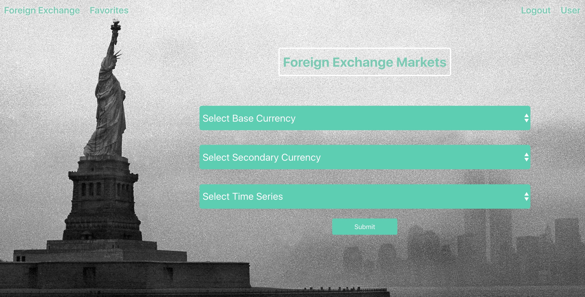
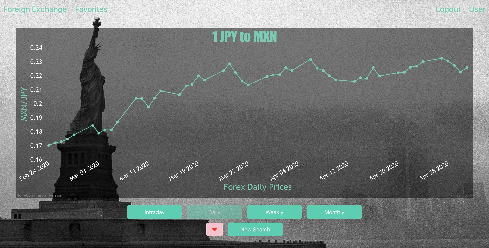

# Foreign Exchange

### Foreign Exchange is a mobile friendly single-page web application that allows users to track exchange rates over different time intervals. Logged-In users can save rates to a favorites list. The data comes from the Alpha Vantage API and the graphs are courtesy of CanvasJS.

## 

## Technologies Used
- HTML
- CSS
- JavaScript
- Express.js
- Node.js
- React
- MongoDB
- Mongoose
- Bulma
- CanvasJS

## Getting Started
- Users are prompted to select a Base and Secondary currency
- Then Select a Time Series to track the exchange rate  
- The heart button is disabled for users not logged-in

[Go To Foreign Exchange](https://fx-tracker.herokuapp.com/)

## Next Steps
#### In the future I plan to add a feature where users can enter in money in one currency and then have it calculated in another.
